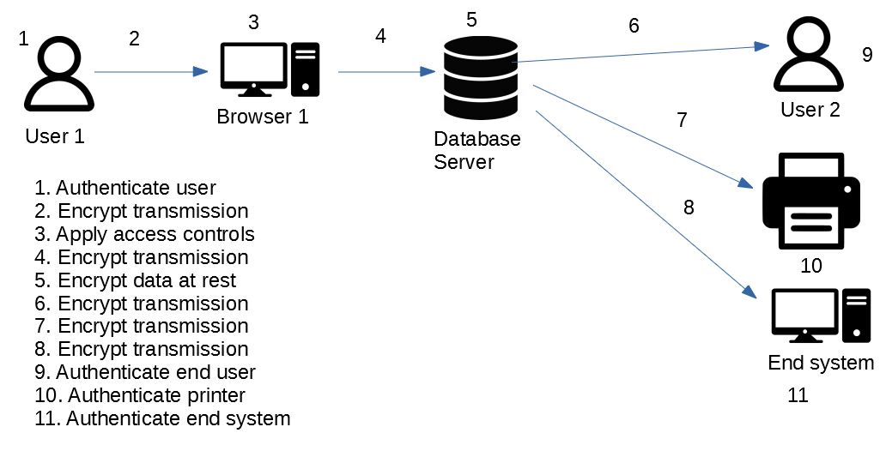

# Requirements Gathering Process

## User Needs document

Study the System Concept document and other document detailing the system design

Identify User and Security Needs

|User Needs|Security Needs|Alternatives|
|----------|--------------|------------|
|e.g. login|e.g.apply permissions|Federation with existing auth|

In detail document the user and security needs for the application

## Security Mapping Document

Referencing the Design Concept documentation, take the processes and roles for all of the subjects and objects and map them to security requirements

## Security Requirements and Test Plan

Using documentation provided (system context document) and the created documents (User Needs and Security Mapping), create a list of security requirements with detailed descriptions and a test plan for each requirement

It will include the following structure (including 1 example requirement)

|Security Requirement|Requirement Description|Test requirement|
|----------|--------------|------------|
|Access Control Enforcement|The system enforces approved authorization for access to the information system resources in accordance with applicable access control policies|Determine if the system enforces applicable approved access control policies for access to the information system|
|

